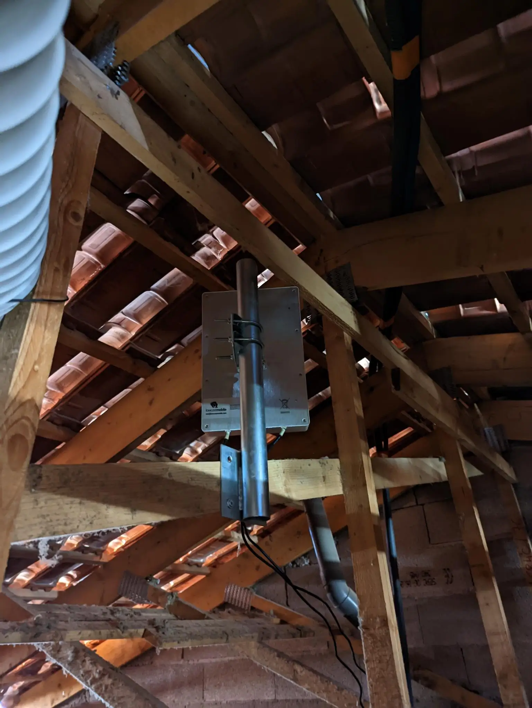

In September 2022 I moved from a one-bedroom apartment to a two floors, three bedroom with garage home. The big issue was the internet connection speed. The default option is ADSL with *14.5 Mb down* and *0.9 Mb up at best*.

My options were:

* ADSL *14.5Mb /  0.9Mb* more or less with all the provider
* 4G only *Orange* have good coverage
* Older Satellite provider but low data cap, big latency, can't really put anything on the roof
* *Starlink* I was really tempted to tried it but same issue I've to fix it on the roof and I still don't manage to get up there, but I think the pole can't handle it with the wind.

I decided to go with the ADSL and 4G.

After I moved in the ADSL provider took some time to get me connected, so I quickly bought a cheap *TP-Link Archer MR400* on my LBC (leboncoin a local Craigslist) the time to research and find a better modem. This give me something like 70Mb/s at the same time the ADSL provider offer me 200 GB on 4G.

Everything escalated quickly. I had my ADSL connected, so after that I needed a router. I found a used *EdgeRouter 4* that was expensive but local and available. In the same time I order a [NanoPI R5S](https://wiki.friendlyelec.com/wiki/index.php/NanoPi_R5S) from China that I was planning to used has a router.

Quickly my network start looking like this

At this point I found a [Nighthawk M1 4G LTE](https://www.netgear.com/home/mobile-wifi/hotspots/mr1100/) to replace the cheap *TP-Link*. This raised my bandwidth to around 150Mbit/s in good condition and 15/20MBit/s of up. I bought a 15€ *Netgear GS302* switch temporarily to connect everything, and I get back a [Unify UAP-AC](https://store.ui.com/products/uap-ac-pro) that I was using during COVID at my parent place.

I tried some of the load balancing feature between the two WANs with 60% on 4G and 40% on the ADSL, but that was weird. Website get confused the latency difference between the two link don't help. 

I hesitate to try [OpenMPTCProuter](https://www.openmptcprouter.com/) but decide not to. You've to used an online server for exit so banking website, netflix etc... will start blocking you or report fraud on your account. 

I decide to  assign everything related to Video/Streaming to the ADSL, mostly the TV/Chromecast and the SO laptop and phone since she is doing a lot of streaming (she will do like 15/20gb over day 🙄 ). The 4G was for my laptops and computers.

The 4G was okay but I was getting some issue to get a good stable connection. Going back to my LBC (leboncoin) I was looking for 4G/5G antenna.

Two good candidates were:

* [Poynting A-XPOL 0002 V3](https://poynting.tech/antennas/xpol-2-5g/)
* [LowcostMobile 4G LTE 5G MIMO Directionnelle](https://lowcostmobile.fr/products/antenne-4g-lte-5g-mimo-directionnelle-700-800-900-1800-2100-2600-mhz-lowcostmobile-2x30cm-noir-connectique-sma-cable-lmr200-pour-huawei-b525-b528-b618-e5180-b715-asus-tp-link-netgear-et)

I found a *LowcostMobile* with 15m of cable connected to it. I order a 50cm Ø 42mm pole with a plate solder on it to be able to attach to another pole.

At this time I did not have a real plan yet, I was maybe planning to put on the roof, but I was uncertain if I will have pole available, or outside. I have what we call a [iron pergola](https://www.savoirfer.fr/wp-content/uploads/2020/02/pergolas-fer-forge-saint-raphael.webp). The issue would have been running the cable from outside and I will not have on view the cell tower.

To identify the cell tower in France, we have a website from the government. It come from the *AFNR*  the agency in charge of the radio frequency. [Carto Radio](https://www.cartoradio.fr/index.html#/). On it, you have a map and can filter by provider, frequencies etc.. The issue is you can't find the *cellid*. There is some open-source database from the cellid lookup, but I was unable to find mine inside.

I tried the antenna at one of the second floor windows and got some good result, the RSSP before was between -105dBm to -115dBm. I get to -73dBm, so I've now a strong signal, but I can't close the windows.

I decide to try to put it into the attic, since I know I will be able to pass wire from the attic to this room. I was just not sure if the 15m of antenna cable where going to be long enough and if the signal will still be good enough.

The signal was still excellent around -75dBm SINR around 10/15dB.

At the same time, I moved my desk from the living room to the basement room next to the garage. The issue was the poor Wifi connection in this room, I can't RDP to my desktop in the living room. If I move the access point, I have connection issue at the second floor. I will have to put the 4G modem at some place near the antenna. At this point, I was sure I need to run wire in the house.

Hopefully, I knew that was possible, some renter before me tried to wired the house in RJ45 and he left one cable between the first and second floor, and some cable between the two room the last floor. The issue was running from the first floor to the basement.

After some serious fight, I manage to pull two cables out in the basement, one running to the first floor and the second one to the second floor. 
Not without doing thing wrong, like cutting through the wrong wall 😅.

My plan was finally possible, I will have a real network. 

I bought like 60m of CAT 6A cable and a lot of keystone and 3 wall plate of 2 RJ45.

I pull out:

* 1 cable to the attic
* 2 cables at the second floor
* 2 cables at the first floor right
* 2 cables at the first floor left 

I should have run one more cable to the attic but I was running out of cable.

One of the wall plate, it's upside down 🤷‍♂️ 

I used a 50mm PVC tube at the end to hide the cable and passing from the basement to first floor but I start getting issue to pull cable at the 90 degree angle. 

For the keystones' connection I used *T568A* this is probably going to hunt me. We all make mistake.

Now I need a network rack. I tried to get the [StarTech.com WALLMOUNT8](https://www.amazon.com/Serveur-Mural-Solide-%C3%A9quipment-Profond/dp/B01M1OLEQD) The one received from *Amazon* was damage and second one they send was damage too 😞.

I decide to find one local and within a day for 40e I found out a *Digitus 12U* (w/ an 8 ports power plug) but a little short in depth only 12" of course I discover that later.

After installing everything

So during that time I found a *Netgear GS324TP* on the LBC new for 120e, but it took 3 weeks to come due to the strike on petrol station resupply. 
 My need was to get something with POE for the two access point, manageable and more or less silent. It's not really silent but not loud, the fan only spin up something everything +/- 15min for 5min I will say and it's in the garage. There is some chance I will replace them by some *Noctua* if I keep the switch,

 The big issue for this switch is no SFP+ but they are all expensive, and I was like 🤔 I will not need it. The management interface is shit, you get disconnected after like 5min and no SSH.

 Inside the rack:

 * patch panel
 * Switch Netgear GS324TP
 * Router Ubiquiti Edgerouter 4
 * a NUC11TNKi5, Nano PI R5S and Raspberry PI 2
 * ADSL Box
 
(That was around the October 20 at the time I already had ordered some part to upgrade few things to 10G 😂)

For the access point I switch to two Unifi UAP-6 Pro one in the basement and the second one on the second floor. With Wifi-6 I can connect close to gigabit speed getting 500/600Mb/s real speed around the house and close to 900Mb/s from time to time.

Temporary solution that will become permanent. I need it to point up, but it can't stay on the floor, the light is never on for a long time, so this seems to work.

The cable is coming from the attic.

I manage to grab for cheap a [Huawei B818-263](https://forum.huawei.com/enterprise/en/huawei-b818-263-an-informative-product-review/thread/864387-100181) and sell the *Netgear M1* for profit. The *B818-263* is great, that get me 250Mb/s down (sometime 300MB/s) and 50Mb/s up. The ping is really stable from 30ms to 40ms when I'm with Orange (or Sosh). 

I have a *Lebara* sim card (it's on the Orange network) they are cheap I get 240gb for 24e, but the issue is the peering especially on the weekend. I get the same speed but from time to time is shit. Sometimes I even get a 20% packet drop too. The exit IP come *Telia* a Swedish telecom operator and every website think I'm a bot 😅

I'm still looking tried to find a better offer.

I put the *B818-263* on POE with a splitter, so I can liberate the outlet in the room and let everything sit in the closet.

Little teasing few weeks after with 10G in place. In the coming post, I will detail the network configuration.

