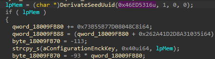
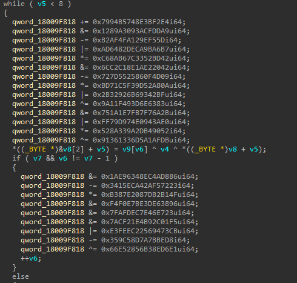
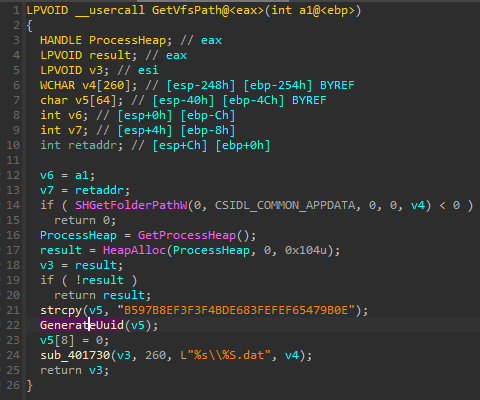
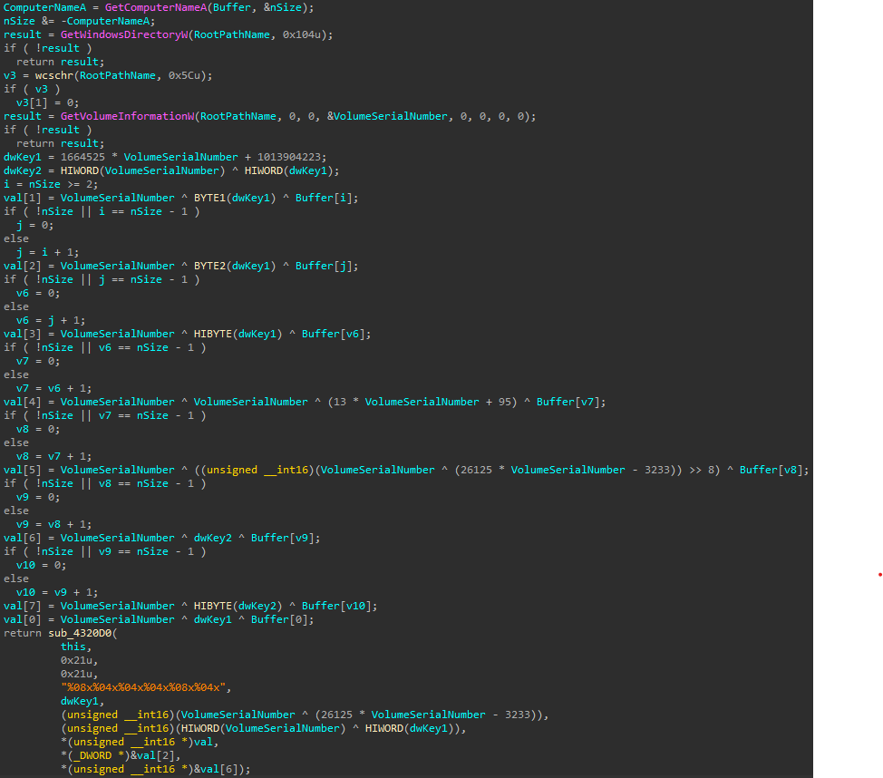
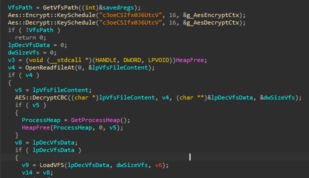
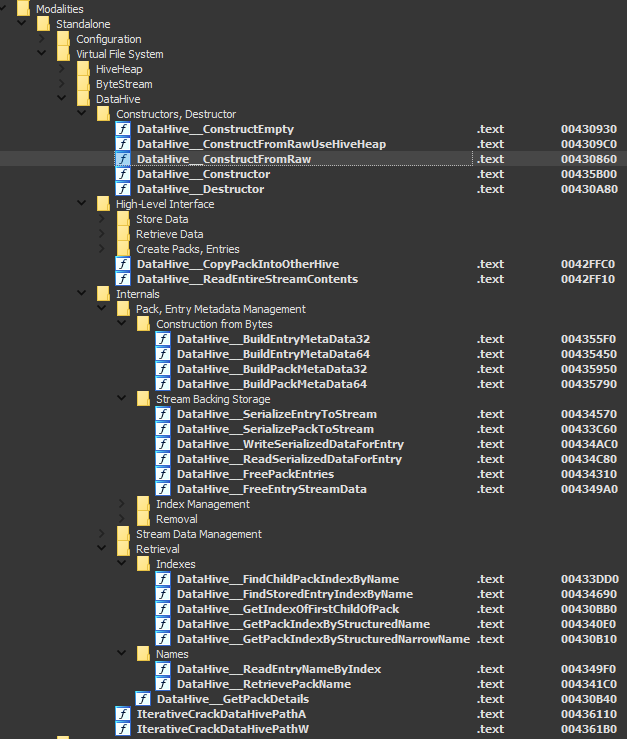
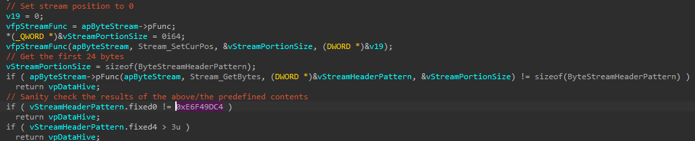

This is some note about Gracewire malware that I come across in last year during some investigation. Maybe this will help some people working on it. I've documented the persistence mechanism and the recovery of the Virtual File System (aka the configuration).

The persistence mechanism was well hidden and under a lot of layer and allow them to be fileless. They change the ComHandler of an existing Windows Task schedule. Tools like *autoruns* still think it's a Windows valid entry and hide it. The timestamp modification of the task schedule file allow to spot the persistence.

Gracewire is complex, [Rolf Rolles publish a state-of-the-art IDB on one version of FlawedGrace/Gracewire](https://www.msreverseengineering.com/blog/2021/3/2/an-exhaustively-analyzed-idb-for-flawedgrace). His work saves me so much time to get the information I needed.


# Gracewire

## Gracewire fileless loading version

This information come from an infected system, where no malware were directly found on the drive.

### Stage 1

The malware maintains persistence by updating an existing Windows task schedule `\Windows\System32\Tasks\Microsoft\Windows\Registry\RegIdleBackup` (this task is hard-coded inside the malware). It changes the `ComHandler` action with the UID `{CF8C0CD5-8DAA-4899-91FE-DF8DD3D165DE}`. 

They did not timestomp the file after updating it. So, it's possible to find the persistence with a timeline analysis.

In the registry, they create the key  `HKLM:\Software\Classes\CLSID\{CF8C0CD5-8DAA-4899-91FE-DF8DD3D165DE}\TreatAs` is set to `{972903D2-3A23-4C4D-A3D2-B6DE37AC983C}`. The execution of the task schedule will, in fact, execute the command saved in `HKLM:\Software\Classes\CLSID\{972903D2-3A23-4C4D-A3D2-B6DE37AC983C}\LocalServer`.

`LocalServer` contains the command below

```
C:\Windows\SYstem32\WindowsPowerShell\v1.0\powershell.exe -WindowStyle Minimized -c "& {iex([System.Text.Encoding]::UTF8.GetString([Convert]::FromBase64String('...')))}"
```

I've to hide the payload a little. This command will load and execute the *PowerShell* script saved in `HKLM:\Software\Classes\CLSID\{972903D2-3A23-4C4D-A3D2-B6DE37AC983C}\ProgID` under the name `{972903D2-3A23-4C4D-A3D2-B6DE37AC983C}`

The two UID derivate from a seed value, but we don't know the seed value.

### Stage 2

Inside the key `HKLM:\Software\Classes\CLSID\{972903D2-3A23-4C4D-A3D2-B6DE37AC983C}\ProgID` the entry name `{972903D2-3A23-4C4D-A3D2-B6DE37AC983C}` has for value a *PowerShell* script.

```
function FFNEJRH{param($FFNEJRHB)[System.Text.Encoding]::UTF8.GetString([Convert]::FromBase64String($FFNEJRHB))....
```

This script loads a DLL from `HKLM:\Software\Classes\CLSID\{972903D2-3A23-4C4D-A3D2-B6DE37AC983C}\VersionIndependentProgID` with the name `{972903D2-3A23-4C4D-A3D2-B6DE37AC983C}` and execute it inside the `powershell.exe` process. 

### Stage 3

This file is not on VT and I can't share it.

| | **stage3.bin** |
|---|:--|
| file size    | 61440 (60.0KiB) |
| file magic   | PE32+ executable (DLL) (GUI) x86-64, for MS Windows |
| PE date      | 2012-12-28 02:58:07 GMT |

This DLL is packed with a simple packer.

| | **stage3.unpack.bin** |
|---|:--|
| file size    | 36864 (36.0KiB) |
| file magic   | PE32+ executable (DLL) (GUI) x86-64, for MS Windows |
| PE date      | 2010-12-14 15:47:25 GMT |

This DLL assumes that it's running inside another thread than the main one; otherwise it will exit. The goal is to load the final payload from a registry key. The registry key used depends on the system information.

This file is later found in the VFS embed inside the installer (file `/c`) with this information. I provide it on the [GitHub repo]().

| | **c.embded.stage3.dll** |
|---|:--|
| file size    | 36864 (36.0KiB) |
| file magic   | PE32+ executable (DLL) (GUI) x86-64, for MS Windows |
| md5          | 18d1e87283eb975a76bb682e59dbaafa |
| sha1         | 24a7988b43b76bc19a814ba5d44a8bd5fa6f54fc |
| sha256       | 0e82f50477a4df52bdee361ef155d3c0496f2cd87523c17f492216e8ebceff9a |
| imphash      | c438b77d56d8a538d975960a500f2199 |
| PE date      | 2014-08-07 02:26:11 GMT |

It generates 3 UID that derivate from a seed, a volume serial id, and computer name ([script is here]()). Depending on the usage, it will be formatted or not.

```
cn: WINDEV2210EVAL; vsn: 0xe241b532; seed: 0x6f3ad240; desc: loader_reg_key; val: {8D7B6772-6772-8D7B-1C17-07FB05037B8D}
cn: WINDEV2210EVAL; vsn: 0xe241b532; seed: 0x91fa4e91; desc: loader_reg_name; val: {73BBFBA3-FBA3-73BB-80C6-C705D49FBB73}
cn: WINDEV2210EVAL; vsn: 0xe241b532; seed: 0x350af376; desc: loader_enc_key; val: 44464bd744464bd7213d37a133224bd7
```

Seed `0x6f3ad240` is used to generate the registry key `SOFTWARE\Classes\CLSID\{8D7B6772-6772-8D7B-1C17-07FB05037B8D}`

Seed `0x91fa4e91` is used to generate the value name of the registry key.

The value will contain a payload encrypted. The key to decrypt it come from the value generated by the seed `0x350af376`. Due to how they implement it, the encryption is weak and can be simplified to a xor with a one-byte key. ([python unpacker here]())

The payload extracted will be called *grace.loader.bin*

### GraceWire loader payload

| | **grace.loader.bin / 6f3ad240.dec.bin** |
|---|:--|
| file size    | 1146880 (1.1MiB) |
| file magic   | PE32+ executable (DLL) (GUI) x86-64, for MS Windows |
| md5          | 534362e1316c41dd0637f757c7766858 |
| sha1         | 0377a70765062922e9b6a2363b958a2dfc8b62f7 |
| sha256       | a2da59241b1f6d898f0f32087b2684da2a38954063b2c0078a459171c27eab26 |
| imphash      |  |
| PE date      | 2012-12-28 02:58:07 GMT |

The same packer as stage 3 is used.

| | **grace.loader.unpack.bin / 6f3ad240.unpack.hd.bin** |
|---|:--|
| file size    | 1122304 (1.1MiB) |
| file magic   | PE32+ executable (DLL) (GUI) x86-64, for MS Windows |
| md5          | 0a8ebb14016dc90af35c6360d73e126a |
| sha1         | cbaffd2383bf9fb518f7a7d13d25a7cc262c99ed |
| sha256       | bb151716c5755f4ddb39ee16f0041e42044e3b408abad1300c7107f727093df9 |
| imphash      | f8f56226b601010b649b11718ebc7593 |
| PE date      | 2015-05-28 06:31:14 GMT |

This is the loader for the main module of *GraceWire/FlawedGrace*, which is in charge to get the configuration and the main module, migrate to another process and execute the main module.

To work on this file, I write few scripts

* [gracewire_loader_string_ida.py]() decrypt and add in comment the string in the IDB
* [qiling_grace_loader_resolv.py]() Qiling script to find out the id, name of import used. This script used to work, but now is failing. I update it to work on the recent Qiling version but during some decryption there is some junk, so it failed to resolv an import and don't get fully initialized.
* [grace_loader_generate_uuid.py]() The script used to generate the UUID for a system common to the different layer.

The malware can load its configuration from at least two different places:

 * From the resource of the DLL himself (resource name `N`) encryption is AES and key is `er0ewjflk3qrhj81`
 * From the registry using a similar system as we saw in stage 3

In this file, the resource section is corrupt, probably on purpose, so it's not inside.

The configuration in the registry for the system can be found in `SOFTWARE\Classes\CLSID\{BB5B4C31-4C31-BB5B-3754-27CD46285BBB}` (seed `0x591af903`). This value is encrypted with *AES-CBC* (slightly modified see below) the key is derivate from seed `0x46ed5316` and only the first 16 bytes or  the UUID without separator are used so `24E6ACA424E6ACA4`.

I provide a copy of the decrypted registry key in `grace_vfs_from_reg_93f4d91a.vfs`

The decrypted data follow the `DataHive` structure describe latter.

Before passing the execution to the main module, the malware will copy the hive to a file in memory under the name `Global\7c1828b07c1828b0196354c60b7c28b0` or `Local\B028187C-187C-B028-6319-54C60B7C28B0`. This come from the seed `0x5269ad4e` but can be modified with the command line parameter `cs`. A mutex is created with the name `m1828B07C1828B0196354C60B7C28B0` using the seed `0x5269ad4e`. This allows modules to get access to the hive data.

UUID and seed value for this payload:

```
cn: WINDEV2210EVAL; vsn: 0xe241b532; seed: 0x46ed5316; desc: config_enc_key; val: A4ACE624E624A4AC 
cn: WINDEV2210EVAL; vsn: 0xe241b532; seed: 0x591af903; desc: config_reg_key; val: {BB5B4C31-4C31-BB5B-3754-27CD46285BBB}
cn: WINDEV2210EVAL; vsn: 0xe241b532; seed: 0x5269ad4e; desc: mutant; val: Local\B028187C-187C-B028-6319-54C60B7C28B0
cn: WINDEV2210EVAL; vsn: 0xe241b532; seed: 0x5269ad4e; desc: mutant; val: Global\7c1828b07c1828b0196354c60b7c28b0
cn: WINDEV2210EVAL; vsn: 0xe241b532; seed: 0x5269ad4e; desc: mutant; val: m1828B07C1828B0196354C60B7C28B0
cn: WINDEV2210EVAL; vsn: 0xe241b532; seed: 0x93f4d91a; desc: unknown; val: {71B56C28-6C28-71B5-174D-C9075F08B571}
cn: WINDEV2210EVAL; vsn: 0xe241b532; seed: 0x6f6772e0; desc: unknown; val: {8D26C7D2-C7D2-8D26-BCB7-5AFBA5A3268D}
```





At that time, I knew that it was loading some kind of VFS, but due to the obfuscation in this version I was not really able to progress quickly. Since I was seeing some kind of configuration and 5 PE files, at that time that was enough information.

One or two months later, I had some spare time and decide to try to reverse the VFS and I found [Rolf Rolles post](https://www.msreverseengineering.com/blog/2021/3/2/an-exhaustively-analyzed-idb-for-flawedgrace) and [IDB](https://github.com/RolfRolles/IDBs/tree/master/FlawedGrace). I was quickly able to write a python script to dump the VFS

```
$ python3 grace_vfs.py -f ../samples/grace_vfs_from_reg_93f4d91a.vfs
ByteStreamHeaderPattern(magic=0xe6f49dc4, fixed4=0x3, m64BitFlag=0x0, dummy0=0x0, dwHeaderLen=0x18, zero=0x0)
pack 0x00000018 | name =
 entry 0x000000db | name = v | 0x1
 entry 0x000000ec | name = l2 | b'MZ\x90\x00\x03\x00\x00\x00\x04\x00\x00\x00\xff\xff\x00\x00\xb8\x00\x00\x00\x00\x00\x00\x00@\x00\x00\x00\x00\x00\x00\x00'
 entry 0x000aa0fe | name = p1 | b'MZ\x90\x00\x03\x00\x00\x00\x04\x00\x00\x00\xff\xff\x00\x00\xb8\x00\x00\x00\x00\x00\x00\x00@\x00\x00\x00\x00\x00\x00\x00'
 entry 0x000af110 | name = p2 | b'MZ\x90\x00\x03\x00\x00\x00\x04\x00\x00\x00\xff\xff\x00\x00\xb8\x00\x00\x00\x00\x00\x00\x00@\x00\x00\x00\x00\x00\x00\x00'
 entry 0x000b5122 | name = ni | AC0EF5AB240F4FA1E09AF46A4F789CD4
 entry 0x000b5183 | name = sr | 0x1
 entry 0x000b5195 | name = hv | 0x42b
 entry 0x000b51a7 | name = h | b'MZ\x90\x00\x03\x00\x00\x00\x04\x00\x00\x00\xff\xff\x00\x00\xb8\x00\x00\x00\x00\x00\x00\x00@\x00\x00\x00\x00\x00\x00\x00'
 entry 0x001cf1b8 | name = avt | 0x1
 entry 0x002cc25b | name = tlc | 0x0
 entry 0x002cc26e | name = au | 0x0
 entry 0x00341292 | name = se | 0x99533bfb
 entry 0x003412a4 | name = ve | 0x1
 entry 0x003412b6 | name = c | b'MZ\x90\x00\x03\x00\x00\x00\x04\x00\x00\x00\xff\xff\x00\x00\xb8\x00\x00\x00\x00\x00\x00\x00@\x00\x00\x00\x00\x00\x00\x00'
 entry 0x003b62c7 | name = lo | 0x2
 pack 0x000b5154 | name = AC0EF5AB240F4FA1E09AF46A4F789CD4
  pack 0x00000038 | name = mt
   entry 0x0000005a | name = w | AC2696B99D5E44B21A9A4B5987DCC0E4
   pack 0x00000049 | name = se
    pack 0x0000008b | name = [0]
     entry 0x0000009d | name = p | 0x1bb
     entry 0x000000ae | name = h | 46.161.40.87
   pack 0x00000027 | name = mo
   pack 0x002cc1ed | name = us
    pack 0x002cc1fe | name = D08F22EDA5AB458E68B9C0D8508ECEDA
     entry 0x002cc22d | name = n | SYSTEM
     entry 0x002cc24a | name = p | 0x218
 pack 0x002cc280 | name = m
```

I dump the VFS, I provide a [copy here]()

```
dump_vfs
├── AC0EF5AB240F4FA1E09AF46A4F789CD4
│   └── mt
│       ├── se
│       │   └── [0]
│       │       ├── h
│       │       └── p
│       ├── us
│       │   └── D08F22EDA5AB458E68B9C0D8508ECEDA
│       │       ├── n
│       │       └── p
│       └── w
├── au
├── avt
├── c
├── h
├── hv
├── l2
├── lo
├── ni
├── p1
├── p2
├── se
├── sr
├── tlc
├── v
└── ve
```

Inside we have the 5 payloads and some configuration fields.

| | **l2** |
|---|:--|
| file size    | 696320 (680.0KiB) |
| file magic   | PE32+ executable (DLL) (GUI) x86-64, for MS Windows |
| md5          | 562dd15f883320fa04c0b5a9bdb003cd |
| sha1         | da74135a4c3630e6a5c7e0d7554bcdd370a76358 |
| sha256       | ca03ff2ab99e9d0bac8e92b0697a2fea0f06d5384648551bb8648efa31f61ed9 |
| imphash      | bbcf353adf7d223bba7b33576d501b1d |
| PE date      | 2014-09-05 01:38:14 GMT |

`l2` is *GraceWire* main module

| | **p1** |
|---|:--|
| file size    | 20480 (20.0KiB) |
| file magic   | PE32 executable (DLL) (GUI) Intel 80386, for MS Windows |
| md5          | 88695dbddd4fc57025b523f4fca268d7 |
| sha1         | 57ab5d9b5302644e91e3953062b40c5346b236e3 |
| sha256       | f92dbf7943590c2c4011f911ba9ba445010c9d5895b5c8b57a5da9c8708c221d |
| imphash      |  |
| PE date      | 2009-10-19 13:41:28 GMT |

`p1` is a 32bit DLL used to inject 32bit payload

| | **p2** |
|---|:--|
| file size    | 24576 (24.0KiB) |
| file magic   | PE32+ executable (DLL) (GUI) x86-64, for MS Windows |
| md5          | b032fcb03d685b591054855572ac8f85 |
| sha1         | 869b38a87802af5628fe8a318323bfcb24229086 |
| sha256       | a0286ea3521167642cbc73dbe1c23bc9870bc7a3012ee521be98b38836ce834e |
| imphash      |  |
| PE date      | 2018-09-08 05:36:12 GMT |

`p2` is a 64bit DLL used to inject 64bit payload

| | **h** |
|---|:--|
| file size    | 1155072 (1.1MiB) |
| file magic   | PE32+ executable (DLL) (GUI) x86-64, for MS Windows |
| md5          | 69d2507bbf73cf4fa6d6ca1647754f03 |
| sha1         | 93eafaa180b5085babee7b2bb85c0a349131328f |
| sha256       | 0d37468eb7748e4f26f54e6858e2e5e2389ba3530552394abbd56bfeb873e5d0 |
| imphash      |  |
| PE date      | 2018-09-08 05:36:12 GMT |

`h` is the *GraceWire* Loader (packed) found in registry

| | **c** |
|---|:--|
| file size    | 479232 (468.0KiB) |
| file magic   | PE32+ executable (DLL) (GUI) x86-64, for MS Windows |
| md5          | 80a20106ced1a5d9f350b1401dbe7d14 |
| sha1         | 753561bf6da3cbb75711d109ed0e38b7abb28db8 |
| sha256       | 6d15a0807858dce0be652e480fa7f298482c7bbf2c1e116e6cf0a3d3df95180f |
| imphash      | 7edbb1f08aaa2756392c6eb6a6201489 |
| PE date      | 2010-05-08 17:04:47 GMT |

`c` is the installer to setup the stage3  ?? two DLLs embedded

## Other versions

This was another file I took a look when I wanted to start looking at the VFS [this file efcee275d23b6e71589452b1cb3095ff92b10ab68cd07957b2ad6be587647b74][https://www.virustotal.com/gui/file/efcee275d23b6e71589452b1cb3095ff92b10ab68cd07957b2ad6be587647b74].

| | **efcee275d23b6e71589452b1cb3095ff92b10ab68cd07957b2ad6be587647b74** |
|---|:--|
| file size    | 564040 (550.8KiB) |
| file magic   | PE32 executable (GUI) Intel 80386, for MS Windows, Nullsoft Installer self-extracting archive |
| md5          | 4b9054475ff9aa15be35b42264715354 |
| sha1         | a088dfaee1779878353a1dc347a91a892e5dfd74 |
| sha256       | efcee275d23b6e71589452b1cb3095ff92b10ab68cd07957b2ad6be587647b74 |
| imphash      | 3abe302b6d9a1256e6a915429af4ffd2 |
| PE date      | 2018-01-30 03:57:45 GMT |

The first layer is pack, once unpack we get this version. The PE timestamp is legit the same timestamp is found in other PE directory entries. A date in strings `Nov 20 2017 10:53:33` is used when building the system information for the field `built`

| | **efcee275d23b6e71589452b1cb3095ff92b10ab68cd07957b2ad6be587647b74_unpacked** |
|---|:--|
| file size    | 455680 (445.0KiB) |
| file magic   | PE32 executable (GUI) Intel 80386, for MS Windows |
| md5          | b405d76e325c20d951e74b33781540ba |
| sha1         | eeb1313ae855af3642a56022eb6298a470d76671 |
| sha256       | efea3b1ccea2a9f592631b282b62ba542d5eb73fd4ee1cecfe4efc379d215305 |
| imphash      | af1157c6aa4a47f92f955f129e023851 |
| PE date      | 2017-11-20 18:54:59 GMT |

This sample doesn't have a VFS/configuration inside, this version doesn't load from the registry or resource.

The part in charge to load the configuration from the disk builds the path to the VFS by getting the value for `CSIDL_COMMON_APPDATA` (normally `C:\ProgramData`); then generate a UUID base on the drive serial number and computername. The algorithm to derivate the UUID is not the same in this one.





The function GenerateUuid start at `0x004323D0` and ends at `0x004325E3`.

I used [Qiling](https://github.com/qilingframework/qiling) to execute the function to be able to generate UUID for targeted system.

The interesting part is here, the complete [script is here]().

```python
    # Set hook on GetVolumeInformationW because Qiling
    # implementation set a string instead of a DWORD in lpVolumeSerialNumber
    # I should push a pull request
    ql.os.set_api("GetVolumeInformationW", my_GetVolumeInformationW, QL_INTERCEPT.CALL)

    # We allocate a buffer and set it as arg0 of the target function
    # IDA detect the calling convention as __thiscall so arg0 is ecx
    ptr = ql.mem.map_anywhere(256, minaddr=0x1000)
    # this string is set the default one set by the malware
    ql.mem.string(ptr, "B597B8EF3F3F4BDE683FEFEF65479B0E")
    ql.arch.regs.write("ecx", ptr)
    #ql.arch.stack_push(ptr)
   
    # We set the sandbox profile to match the target VSN and computername
    ql.os.profile["VOLUME"]["serial_number"] = f'{vsn:d}'
    ql.os.profile["SYSTEM"]["computername"] = computername

    # The unpack version as a bug in the CRT (maybe a bad unpack)
    # we have to stop before the vsnprintf and dump the fmt parameter by hand
    # ql.run(begin=0x4323d0, end=0x4325d7)
    # data = ql.mem.read(ptr, 128)

    ql.run(begin=0x4323d0, end=0x4325c7)

    # We are at the call to vsnprintf we can dump the parameters
    [buffer, buffercount, maxcount, ptr_fmt, arg0, arg1, arg2, arg3, arg4, arg5] = \
        [ ql.arch.stack_pop(), ql.arch.stack_pop(), ql.arch.stack_pop(),
         ql.arch.stack_pop(), ql.arch.stack_pop(), ql.arch.stack_pop(),
         ql.arch.stack_pop(), ql.arch.stack_pop(), ql.arch.stack_pop(),
         ql.arch.stack_pop()]
    
    # We read the format string from the ptr and format it
    fmt = ql.mem.string(ptr_fmt)
    uuid = fmt % ( arg0, arg1, arg2, arg3, arg4, arg5 )
    return uuid
```

```shell
$ export QL_ROOTFS=$HOME/truenas/lab-re/qiling/rootfs
$ python3 qiling_grace_uuid.py ../efcee275d23b6e71589452b1cb3095ff92b10ab68cd07957b2ad6be587647b74/efcee275d23b6e71589452b1cb3095ff92b10ab68cd07957b2ad6be587647b74_unpacked 0xe241b532 WINDEV2210EVAL
WINDEV2210EVAL ; 0xe241b532 ; 99d912e9a7db7b98698cc3acefa57b98
```

For the test system the file will be in `C:\ProgramData\99d912e9a7db7b98698cc3acefa57b98.dat`

Now we are able to locate the VFS file.

The VFS for this version is encrypted in *AES CBC* and used the key `c3oeCSIfx0J6UtcV`



## Custom AES implementation

The implementation of AES CBC have a subtlety for the last block.

```python
import aes # https://raw.githubusercontent.com/boppreh/aes/master/aes.py

###
# Grace custom AES
###
class GraceAes(aes.AES):
    def decrypt_cbc(self, data):
        fp = io.BytesIO(data)
        dwLen = len(data)

        previous = fp.read(0x10)
        dst = b'' 

        while True:
            if fp.tell() >= dwLen - 0x20:

                # Read last full block and decrypt it
                d = fp.read(0x10)
                val = self.decrypt_block(d)

                # Read the final block and xor with decrypted last full block
                d2 = fp.read(0x10)
                val2 = aes.xor_bytes(val, d2)

                # Append the decrypted block bytes to get a full block
                d2 += bytes(val[-(0x10-len(d2)):])

                # decrypt and CBC
                val = self.decrypt_block(d2)
                val = aes.xor_bytes(previous, val)

                dst += val
                dst += val2
                break
                # last case


            d = fp.read(0x10)
            val = self.decrypt_block(d) # decrypt
            val = aes.xor_bytes(previous, val) # do CBC
            dst += val
            previous = d

        return dst
```


## The VFS

Now that's when I found [Rolf Rolles IDB](https://www.msreverseengineering.com/blog/2021/3/2/an-exhaustively-analyzed-idb-for-flawedgrace) saved me a lot of time.

He calls those functions `DataHive`.



Since he reversed all the internal structure, decoding the VFS was just a matter of copying the structure in a python script and follow the   `DataHive::Constructor` method.

```python
class VFS_ByteStreamHeaderPattern(CStruct_):
    __def__ = """
        struct {
            uint32_t magic;
            uint16_t fixed4;
            uint8_t m64BitFlag;
            uint8_t dummy0;
            uint64_t dwHeaderLen;
            uint64_t zero;
        }
    """

class VFS_SerializedEntry32(CStruct_):
    __def__ = """
        struct {
            uint32_t dwNextEntryStreamPos;
            uint32_t dwDataStreamPos;
            uint32_t dwSerializedSize;
            uint8_t bValueType;
            uint8_t bEntryNameIsWideString;
            uint8_t wEntryNameLen;
            uint8_t dummy;
        }
    """

class VFS_SerializedPack32(CStruct_):
    __def__ = """
        struct {
            uint32_t dwStreamPos_NextSiblingPack;
            uint32_t dwStreamPos_FirstChildPack;
            uint32_t dwStreamPos_FirstEntry;
            uint8_t bEntryNameIsWideString;
            uint8_t wEntryNameLen;
            uint8_t dummy;
        }
    """

class VFS_SerializedPack64(CStruct_):
    __def__ = """
        struct {
            uint64_t dwStreamPos_NextSiblingPack;
            uint64_t dwStreamPos_FirstChildPack;
            uint64_t dwStreamPos_FirstEntry;
            uint8_t bEntryNameIsWideString;
            uint16_t wEntryNameLen;
        }
    """


def VFS_StrData(data):
    if isinstance(data, bytes):
        return f'{data[0:0x10]}'
    elif isinstance(data, int):
        return f'0x{data:x}'
    else:
        return f'{data}'


def VFS_UnserializedData(fp, se):
    fp.seek(se.dwDataStreamPos)
    if se.bValueType == 0: # Bytes
        return fp.read(se.dwSerializedSize)
    elif se.bValueType == 1: # Int
        return se.dwDataStreamPos
        #return struct.unpack('<I', fp.read(se.dwSerializedSize))[0]
    elif se.bValueType == 2: # Int64
        return struct.unpack('<Q', fp.read(se.dwSerializedSize))[0]
    elif se.bValueType == 3: # String
        return fp.read(se.dwSerializedSize).decode()
    elif se.bValueType == 4: # WString
        return fp.read(se.dwSerializedSize).decode()
    return None

def VFS_BuildEntryMetaData32(fp, pos, depth=0, path='', cb=None):
    s = VFS_SerializedEntry32()
    while(True):
        fp.seek(pos)
        try:
            s.unpack(fp)
        except:
            return

        name = fp.read(s.wEntryNameLen)
        try:
            name = name.decode()
        except:
            logger.debug('failed to decode name')
            pass

        try:
            data = VFS_UnserializedData(fp, s)
            try:
                if cb: cb(f'{path}/{name}', data) 
            except Exception:
                logger.exception("cb")

            logger.debug(f'{" " * depth}entry 0x{pos:08x} | name = {name} | {VFS_StrData(data)}')
        except:
            logger.exception("failed to UnserializedData")
            logger.debug(f'{" " * depth}entry 0x{pos:08x} | name = {name}')
        if not s.dwNextEntryStreamPos:
            return

        pos = s.dwNextEntryStreamPos

def VFS_BuildPackMetaData32(fp, pos, depth=0, path='', cb=None):
    s = VFS_SerializedPack32()
    while(True):
        fp.seek(pos)
        s.unpack(fp)

        fp.seek(pos + s.size -1)
        name = fp.read(s.wEntryNameLen)
        try:
            name = name.decode()
        except:
            pass

        # First name is empty so we want to avoid //
        if name != '':
            path_ = f'{path}/{name}'
        else:
            path_ = ''

        logger.debug(f'{" " * depth}pack 0x{pos:08x} | name = {name}')

        if s.dwStreamPos_FirstEntry:
            VFS_BuildEntryMetaData32(fp, s.dwStreamPos_FirstEntry, depth+1, path_, cb)
        if s.dwStreamPos_FirstChildPack:
            VFS_BuildPackMetaData32(fp, s.dwStreamPos_FirstChildPack, depth+1, path_, cb)
        if not s.dwStreamPos_NextSiblingPack:
            return
        
        pos = s.dwStreamPos_NextSiblingPack

```

Something interesting in the `DataHive::Constructor` is that the VFS start with a magic `0xE6F49DC4`. 



# The hunt

I decide to try to find new samples in the hope to collect some VFS so I wrote some Yara rules and run it on VT

```yara
import "pe"

rule gracewire_rsrc_names
{
    condition:
        pe.number_of_resources >= 1 and    
        for any y in (0..pe.number_of_resources - 1): (
            pe.resources[y].name_string == "XC\x00\x00\x00")
}

rule gracewire_vfs_header 
{
    strings:
        $magic =  { c4 9d f4 e6 03 00 00 00 }
    condition:
        $magic
}

rule gracewire_packer_01
{
    strings:
        $name = "c.dll"
        $ldrloaddll = { C6 44 ?? ?? 4C
                        C6 44 ?? ?? 64 
                        C6 44 ?? ?? 72 
                        C6 44 ?? ?? 4c 
                        C6 44 ?? ?? 6f 
                        C6 44 ?? ?? 61 
                        C6 44 ?? ?? 64 
                        C6 44 ?? ?? 44 
                        C6 44 ?? ?? 6c 
                        C6 44 ?? ?? 6c }
        
    condition:
        $name and $ldrloaddll

}

// content:"f93j5RFRjhf2ASfy" or content:"er0ewjflk3qrhj81" or content:"c3oeCSIfx0J6UtcV" or content:"kwREgu73245Nwg7842h" or content:{12 20 A5 16 76 E7 79 BD 87 7C BE CA C4 B9 B8 69 6D 1A 93 F3 2B 74 3A 3E 67 90 E4 0D 74 56 93 DE 58 B1 DD 17 F6 59 88 BE FE 1D 6C 62 D5 41 6B 25 BB 78 EF 06 22 B5 F8 21 4C 6B 34 E8 07 BA F9 AA }
rule gracewire_keys
{
    strings:
        $k1 = "f93j5RFRjhf2ASfy"
        $k2 = "er0ewjflk3qrhj81"
        $k3 = "c3oeCSIfx0J6UtcV"
        $k4 = "kwREgu73245Nwg7842h"
        $k5 = "1220A51676E779BD877CBECAC4B9B8696D1A93F32B743A3E6790E40D745693DE58B1DD17F65988BEFE1D6C62D5416B25BB78EF0622B5F8214C6B34E807BAF9AA"
        $k6 = {12 20 A5 16 76 E7 79 BD 87 7C BE CA C4 B9 B8 69 6D 1A 93 F3 2B 74 3A 3E 67 90 E4 0D 74 56 93 DE 58 B1 DD 17 F6 59 88 BE FE 1D 6C 62 D5 41 6B 25 BB 78 EF 06 22 B5 F8 21 4C 6B 34 E8 07 BA F9 AA }
    condition:
        any of them
}
```

The gracewire_keys are keys that I've collect used to encrypt most of the time the resources.

I get some hit, and I still get some from time to time, but everything is mostly old. Some samples have a small VFS in the resource, but the IOC are known and old. If it's in the resource after the decryption, we need to inflate it *lznt1* before parsing the VFS (@todo verify).

One hit was exciting because the rule was `gracewire_vfs_header` so an embed VFS without encryption. 

```
gracewire_vfs_header P2P/926b145b5bda585657326e0f08c9aebb1be698e4f617c08352da50532a989244
```

That was a sample I never met before but with the style of the Grace developer

# A P2P botnet

| | **926b145b5bda585657326e0f08c9aebb1be698e4f617c08352da50532a989244** |
|---|:--|
| file size    | 548352 (535.5KiB) |
| file magic   | PE32 executable (DLL) (GUI) Intel 80386, for MS Windows |
| md5          | 029338d01927c127d703625a3cd3d46d |
| sha1         | 61ea8be635f0e6b62e618fe4e4d23f3238847eb4 |
| sha256       | 926b145b5bda585657326e0f08c9aebb1be698e4f617c08352da50532a989244 |
| imphash      | 1ec7c4f47b9b2cc9fc83c06310bc0b21 |
| PE date      | 2021-05-24 12:27:57 GMT |
| VT ratio     | detection 5/67 |
| VT scan_date | 2022-01-09 23:15:54 |
| VT link      | [link](https://www.virustotal.com/gui/file/926b145b5bda585657326e0f08c9aebb1be698e4f617c08352da50532a989244/detection/f-926b145b5bda585657326e0f08c9aebb1be698e4f617c08352da50532a989244-1641770154) |


I start looking around the internet and I found out this was not very new NCC Group had already published some information on it.

https://research.nccgroup.com/2021/12/01/tracking-a-p2p-network-related-with-ta505/

The structures they provide help me to start writing a [P2P client in Python](), but at the end I was unable to finish it.

The first configuration inside the sample is

```
$ python3 ../tools2/grace_vfs.py -f 926b145b5bda585657326e0f08c9aebb1be698e4f617c08352da50532a989244.vfs.config
VFS_ByteStreamHeaderPattern(magic=0xe6f49dc4, fixed4=0x3, m64BitFlag=0x0, dummy0=0x0, dwHeaderLen=0x18, zero=0x0)
32      <class 'str'>   /cx/nid 1CF094259E06664DA5504A5E1C551759
4       <class 'int'>   /cx/dgx 0x4
4       <class 'int'>   /cx/exe 0x2
451     <class 'bytes'> /cx/key b'-----BEGIN PUBLI'
4       <class 'int'>   /cx/port        0xce5d
4       <class 'int'>   /va/45.129.137.237      0x84ac
4       <class 'int'>   /va/78.128.112.139      0x84ac
```

* `/cx/nid` is the network id
* `/cx/exe` DLL/exe
* `/cx/key` a RSA public key
* `/cx/port` the port to listen to on UDP
* `/va` the filename is the IP and the content of the entry the port to connect


The second one is

```
$ python3 ../tools2/grace_vfs.py -f 926b145b5bda585657326e0f08c9aebb1be698e4f617c08352da50532a989244.vfs2.config
VFS_ByteStreamHeaderPattern(magic=0xe6f49dc4, fixed4=0x3, m64BitFlag=0x0, dummy0=0x0, dwHeaderLen=0x18, zero=0x0)
4       <class 'int'>   /meta/app       0x1
4       <class 'int'>   /meta/mod       0x1
4       <class 'int'>   /meta/bld       0x1
4       <class 'int'>   /meta/api       0x1
4       <class 'int'>   /meta/llr       0x1
4       <class 'int'>   /meta/llt       0x1
```

I was able to recover some records from peers.

This based on my vague souvenir.

This record is an update command received from one of the peers:

* `/meta/pwd` is the password to decrypt the record
* `/meta/seal` is some kind of signature (RSA ?) to avoid hijacking the botnet
* `/meta/cfg` is a another VFS inside
* `/hash` is the information to ask for file block for the update, each block is 0x1000 bytes and a hash is provided.
* `/drop` I don't remember, maybe some kind of blacklist to remove bad node?

```
$ python3 ../../tools2/grace_vfs.py -f record_997378FCD959AA48893CB3BB84541841.bin
VFS_ByteStreamHeaderPattern(magic=0xe6f49dc4, fixed4=0x3, m64BitFlag=0x0, dummy0=0x0, dwHeaderLen=0x18, zero=0x0)
32      <class 'str'>   /meta/net       1CF094259E06664DA5504A5E1C551759
32      <class 'str'>   /meta/id        997378FCD959AA48893CB3BB84541841
6       <class 'str'>   /meta/tag       update
4       <class 'int'>   /meta/sta       0x1d7523c51f1de80
4       <class 'int'>   /meta/load      0x1df35
4       <class 'int'>   /meta/snc       0x1d7523c51e5f7a0
4       <class 'int'>   /meta/utl       0x0
12      <class 'str'>   /meta/uni       update.block
32      <class 'str'>   /meta/pwd       D486BB2FAB71BB44821A327124CA9233
256     <class 'bytes'> /meta/seal      b'\x89oy\xed\xa24\xfcL\xe5uN\xf2sM\xe4\xd2'
125     <class 'bytes'> /meta/cfg       b'\xc4\x9d\xf4\xe6\x03\x00\x00\x00\x18\x00\x00\x00\x00\x00\x00\x00'
4       <class 'int'>   /hash/dgst      0x4
4       <class 'int'>   /hash/size      0x20
4       <class 'int'>   /hash/0/ofs     0x0
4       <class 'int'>   /hash/0/size    0x1000
32      <class 'bytes'> /hash/0/hash    b'\x82\x8e\xa2\xa6w\xbf\x80g\x1c\x0b\x99W\xc3)\x99\xa5'
4       <class 'int'>   /hash/1/ofs     0x1000
4       <class 'int'>   /hash/1/size    0x1000
32      <class 'bytes'> /hash/1/hash    b'=\x82"2\xd7^\xbb\x8d:[\xeb\xef\xf9\x1c\xbb\xc0'
4       <class 'int'>   /hash/2/ofs     0x2000
4       <class 'int'>   /hash/2/size    0x1000
32      <class 'bytes'> /hash/2/hash    b't\xfc\x82\xfb\xe4M}\xe1\x14\xb1\xe6r\x0f\xf0G\xbe'
4       <class 'int'>   /hash/3/ofs     0x3000
4       <class 'int'>   /hash/3/size    0x1000
32      <class 'bytes'> /hash/3/hash    b'NU\xf2\x00\x9ea1\x8dvi\xcc\x82\xb38\x8e\xc0'
4       <class 'int'>   /hash/4/ofs     0x4000
4       <class 'int'>   /hash/4/size    0x1000
32      <class 'bytes'> /hash/4/hash    b'#j\x9c\xe7\xac\xea\xc7\x8a\n\xf0\xf7\x98\x95<\x01Q'
4       <class 'int'>   /hash/5/ofs     0x5000
4       <class 'int'>   /hash/5/size    0x1000
32      <class 'bytes'> /hash/5/hash    b'\xb9\x97\xa1jK<\xa8in)R\xd2\x87\x8cLR'
4       <class 'int'>   /hash/6/ofs     0x6000
4       <class 'int'>   /hash/6/size    0x1000
32      <class 'bytes'> /hash/6/hash    b'\xd6Eil\xa7\xb4\x8c\x0e\xb4\x97\x91\xdb\x8eC\x155'
4       <class 'int'>   /hash/7/ofs     0x7000
4       <class 'int'>   /hash/7/size    0x1000
32      <class 'bytes'> /hash/7/hash    b'\xea\x06\xb0WF\x06\xfeUh\xe5&o\xf5\xab\tH'
4       <class 'int'>   /hash/8/ofs     0x8000
4       <class 'int'>   /hash/8/size    0x1000
32      <class 'bytes'> /hash/8/hash    b'\xe1*\x06\xd6-\xad\xe5\x9b\xcb?\x96\x11\xf6\x88\x86\x8e'
4       <class 'int'>   /hash/9/ofs     0x9000
4       <class 'int'>   /hash/9/size    0x1000
32      <class 'bytes'> /hash/9/hash    b'J\x96[\x05\xafs2Q\xed&\xb7$\xf8\nL\x12'
4       <class 'int'>   /hash/A/ofs     0xa000
4       <class 'int'>   /hash/A/size    0x1000
32      <class 'bytes'> /hash/A/hash    b'\xd9\x9c\xa4L\xbe\xe3\xe9\x87\x8a\xd2\x99J\xe6P4\x9a'
4       <class 'int'>   /hash/B/ofs     0xb000
4       <class 'int'>   /hash/B/size    0x1000
32      <class 'bytes'> /hash/B/hash    b'||\xfb<\x10Y\xceV\xe3C\x97\xa2\xc0E\xae\x16'
4       <class 'int'>   /hash/C/ofs     0xc000
4       <class 'int'>   /hash/C/size    0x1000
32      <class 'bytes'> /hash/C/hash    b')7\xcdN\xfe\xc2\x80\xc32\xf5Tu`\x83\xc5\xd3'
4       <class 'int'>   /hash/D/ofs     0xd000
4       <class 'int'>   /hash/D/size    0x1000
32      <class 'bytes'> /hash/D/hash    b'\xa5\xdc\xf1D\x86\x9f\x80\x9c\x7f\xb7D\xcd\x19\xea\xd1Q'
4       <class 'int'>   /hash/E/ofs     0xe000
4       <class 'int'>   /hash/E/size    0x1000
32      <class 'bytes'> /hash/E/hash    b'\xcf\xea,-)\xf8!`8*\xd7\xabEW&v'
4       <class 'int'>   /hash/F/ofs     0xf000
4       <class 'int'>   /hash/F/size    0x1000
32      <class 'bytes'> /hash/F/hash    b'\x83\\1WI\x86\x1aq\x88~\xdd\xdf\xc5+\x9b3'
4       <class 'int'>   /hash/10/ofs    0x10000
4       <class 'int'>   /hash/10/size   0x1000
32      <class 'bytes'> /hash/10/hash   b'\xd2\xe1\xac/\x83\xe5\xf9\xe2\xd3\xde\x119\xe1\xe4\xb44'
4       <class 'int'>   /hash/11/ofs    0x11000
4       <class 'int'>   /hash/11/size   0x1000
32      <class 'bytes'> /hash/11/hash   b'\xf6\xb7\xed\x8a\xda\x80\xed\x06\x8e\xa9\xc9\x9c<\x15m\xd7'
4       <class 'int'>   /hash/12/ofs    0x12000
4       <class 'int'>   /hash/12/size   0x1000
32      <class 'bytes'> /hash/12/hash   b'\x03\x11\xff\xf8\xeb\xd5\xba2O\xcdi\x90\xf5^\xcc\x8a'
4       <class 'int'>   /hash/13/ofs    0x13000
4       <class 'int'>   /hash/13/size   0x1000
32      <class 'bytes'> /hash/13/hash   b'<\xddY\x13\xedI\x11\xa0\xd1\xaa\xc5\xd9\xe2I\xc4\xe9'
4       <class 'int'>   /hash/14/ofs    0x14000
4       <class 'int'>   /hash/14/size   0x1000
32      <class 'bytes'> /hash/14/hash   b'\xad%~e\xccU\xbc\x97\xf5\xe7#\xe7[\x1b\xd36'
4       <class 'int'>   /hash/15/ofs    0x15000
4       <class 'int'>   /hash/15/size   0x1000
32      <class 'bytes'> /hash/15/hash   b'\xee\xe2\xf72\xc5\x8aJ\x0ciOS\xf8[\xfc\xbb8'
4       <class 'int'>   /hash/16/ofs    0x16000
4       <class 'int'>   /hash/16/size   0x1000
32      <class 'bytes'> /hash/16/hash   b'1\x90\xcbu\xdf7\xbb\xd6\n\xd8\xf8\x18\xb6\xf2\x18\xe0'
4       <class 'int'>   /hash/17/ofs    0x17000
4       <class 'int'>   /hash/17/size   0x1000
32      <class 'bytes'> /hash/17/hash   b'\xda\xbc\xecZ\x93j\xda\x8ay\x14\xd5_\xc4\xa7\xa5"'
4       <class 'int'>   /hash/18/ofs    0x18000
4       <class 'int'>   /hash/18/size   0x1000
32      <class 'bytes'> /hash/18/hash   b'\x8f\xdd\xf9d\xc0\x1fq0_\xe7\xb1\xf9.\xec\xef\x18'
4       <class 'int'>   /hash/19/ofs    0x19000
4       <class 'int'>   /hash/19/size   0x1000
32      <class 'bytes'> /hash/19/hash   b'\xed/#\x85\xf4\xf1\xfe)\xdah\xe4Sw\xad\xf9\xc2'
4       <class 'int'>   /hash/1A/ofs    0x1a000
4       <class 'int'>   /hash/1A/size   0x1000
32      <class 'bytes'> /hash/1A/hash   b'\x882`x*\xf3\xf8\\\x80\x05m=>4\xac\xab'
4       <class 'int'>   /hash/1B/ofs    0x1b000
4       <class 'int'>   /hash/1B/size   0x1000
32      <class 'bytes'> /hash/1B/hash   b'\xc2\xd36,\xeb\xeaN\xc4BD\xac\xd9\xf2k\xe1\x92'
4       <class 'int'>   /hash/1C/ofs    0x1c000
4       <class 'int'>   /hash/1C/size   0x1000
32      <class 'bytes'> /hash/1C/hash   b'\xf6<\xf5O\xd0\xa9\x1ez}f_B\x12\xc7g\x1c'
4       <class 'int'>   /hash/1D/ofs    0x1d000
4       <class 'int'>   /hash/1D/size   0xf35
32      <class 'bytes'> /hash/1D/hash   b'm\x96\xcfC\xd0Z88Ar\xd3\xce\xa8\x03\xe8\xbd'
13      <class 'str'>   /drop/0/host    194.165.16.94
4       <class 'int'>   /drop/0/port    0x8ad5
```

From `/meta/cfg`

```
32      <class 'str'>   /fp     B88763DF8318F4962F0EFD398234DF96
4       <class 'int'>   /rs     0x1
4       <class 'int'>   /md     0x0
```

I rewrite kind of pkt_handler in python

```python
    def pkt_handler(self, addr, pkt, pkt_data, data):
        if pkt.bFrameId == 0x10:
            logging.info(f'[#] echo recv')
        elif pkt.bFrameId == 0x7:
            logging.info(f'[#] fit one packet')
            hdr = NodePktDataHeader()
            hdr.unpack(data)
            logging.info(f'{hdr}')
            if hdr.bCmdId == 0x1:
                logging.info(f'  [#] invitation packet')
                inv = NodePktInvitation()
                inv.unpack(data)
                logging.info(f'  {inv}')
            elif hdr.bCmdId == 0x2:
                logging.info(f'  [#] add node to probes')
                inv = NodePktInvitation()
                inv.unpack(data)
                logging.info(f'  {inv}')
            elif hdr.bCmdId == 0x03:
                logging.info(f'  [#] Get a ping request')
                node_info = unserialized(data[hdr.size:])
                logging.info(f'  node_info: {node_info} | {node_info[1]}/{node_info[0]} connections | {node_info[2]} records')
                # @todo implement response
            elif hdr.bCmdId == 0x4:
                logging.info(f'  [#] node info')
                node_info = unserialized(data[hdr.size:])
                logging.info(f'  node_info: {node_info} | {node_info[1]}/{node_info[0]} connections | {node_info[2]} records')
            elif hdr.bCmdId == 0x05: 
                logging.info(f'  [#] Get a new node')
                fp = io.BytesIO(data[hdr.size:])
                node_id = fp.read(0x10)
                node_port = struct.unpack('<H', fp.read(2))[0]
                node_ip = fp.read(ord(fp.read(1))).decode()
                logging.info(f'  node_id: {node_id.hex()} node: {node_ip}:{node_port:d}')
                n = { 'addr': [node_ip, node_port], 'node_id': node_id.hex()}

                is_exist = False
                for v in self.store['nodes']:
                    if v['node_id'] == node_id.hex():
                        is_exist = True
                        break

                if not is_exist: 
                    logging.info(f'  adding node to store')
                    self.store['nodes'].append(n)
                    self.send_invitation(n['addr'])


            elif hdr.bCmdId == 0x06:
                logging.info(f'  [#] Get a record metadata')
                record_id =  data[hdr.size:hdr.size+0x10]
                record_info = unserialized(data[hdr.size+0x10:])
                logging.info(f'  record_id: {record_id.hex()} record_info: {record_info}')
            elif hdr.bCmdId == 0xa:
                logging.info(f'  [#] Get a record')
                r = NodePktRecord()
                r.unpack(data)
                logging.info(f'  {r}')

            else:
                logging.info(f'  [#] unsupported hdr.bCmdId 0x{hdr.bCmdId:x}')
        elif pkt.bFrameId == 0xd:
            open(f'record_{pkt_data.dwUnk}_{pkt_data.dwCurId}_{pkt_data.dwTotal}.bin', 'wb').write(data)
            pass
        else:
            logging.info(f'[#] unsupported pkt.bFrameId 0x{pkt.bFrameId:x}')
```


On execution, the malware use the file system to store information about the P2P network state. Most of the file follow the VFS structure. In `fs_files_from_sandbox.zip`

```
├── net.dsx
├── node
│   ├── 997378FCD959AA48893CB3BB84541841
│   │   ├── l
│   │   ├── m
│   │   └── p
│   └── BBBD9035B2A3CE4FB2A563F5FC6572DF
│       ├── l
│       ├── m
│       └── p
├── probes.dsx
├── reports.dsx
├── sessions
│   └── 40DFE0CD66457646B3990B9B2160F622
├── trash
├── units
│   ├── block
│   │   └── block.dll
│   └── exec
│       ├── exec.dll
├── units.dsx
└── updates
```

* `net.dsx` contain the node id
* `node` contains record received from node, the sub key is the record id
 * `l` unknown
 * `m` contains the record meta data
 * `p` is the record data
 * `session` the files inside are VFS, but I don't remember
 * `probe.dsx` contains other node information
 * `units` contains the *unit* it's the payload recover from the record download from node in `p`

```
$ python3 ../../tools2/grace_vfs.py -f net.dsx
VFS_ByteStreamHeaderPattern(magic=0xe6f49dc4, fixed4=0x3, m64BitFlag=0x0, dummy0=0x0, dwHeaderLen=0x18, zero=0x0)
32      <class 'str'>   /gx/id  67E3945FF45AC644982765568986F30A

$ python3 ../../tools2/grace_vfs.py -f units.dsx
VFS_ByteStreamHeaderPattern(magic=0xe6f49dc4, fixed4=0x3, m64BitFlag=0x0, dummy0=0x0, dwHeaderLen=0x18, zero=0x0)
32      <class 'str'>   /blo/rec        997378FCD959AA48893CB3BB84541841
100     <class 'str'>   /blo/exec       C:\Users\John\Desktop\target\units\block\block.dll
4       <class 'int'>   /blo/meta/app   0x1
4       <class 'int'>   /blo/meta/mod   0x2
10      <class 'str'>   /blo/meta/name  block
4       <class 'int'>   /blo/meta/bld   0x1
4       <class 'int'>   /blo/meta/hlt   0x1
4       <class 'int'>   /blo/meta/api   0x1
32      <class 'str'>   /ex/rec BBBD9035B2A3CE4FB2A563F5FC6572DF
96      <class 'str'>   /ex/exec        C:\Users\John\Desktop\target\units\exec\exec.dll
4       <class 'int'>   /ex/meta/app    0x1
4       <class 'int'>   /ex/meta/mod    0x2
8       <class 'str'>   /ex/meta/name   exec
4       <class 'int'>   /ex/meta/bld    0x1
4       <class 'int'>   /ex/meta/hlt    0x1
4       <class 'int'>   /ex/meta/api    0x1

$ python3 ../../tools2/grace_vfs.py -f probes.dsx
VFS_ByteStreamHeaderPattern(magic=0xe6f49dc4, fixed4=0x3, m64BitFlag=0x0, dummy0=0x0, dwHeaderLen=0x18, zero=0x0)
4       <class 'int'>   /78.128.112.139/33964/curr      0x2
4       <class 'int'>   /78.128.112.139/33964/max       0x5
4       <class 'int'>   /78.128.112.139/33964/next      0x1d8228c5da8f7b0

$ python3 ../../tools2/grace_vfs.py -f reports.dsx
VFS_ByteStreamHeaderPattern(magic=0xe6f49dc4, fixed4=0x3, m64BitFlag=0x0, dummy0=0x0, dwHeaderLen=0x18, zero=0x0)
32      <class 'str'>   /0536FC541A7AC84DA4D94C46541B475A/rec   997378FCD959AA48893CB3BB84541841
13      <class 'str'>   /0536FC541A7AC84DA4D94C46541B475A/ah    194.165.16.94
4       <class 'int'>   /0536FC541A7AC84DA4D94C46541B475A/ap    0x8ad5
4       <class 'int'>   /0536FC541A7AC84DA4D94C46541B475A/ec    0x0
4       <class 'int'>   /0536FC541A7AC84DA4D94C46541B475A/atm   0x3e8
4       <class 'int'>   /0536FC541A7AC84DA4D94C46541B475A/last  0x0
4       <class 'int'>   /0536FC541A7AC84DA4D94C46541B475A/es    0x1d8228c1b9030f0

$ python3 ../../tools2/grace_vfs.py -f sessions/40DFE0CD66457646B3990B9B2160F622
VFS_ByteStreamHeaderPattern(magic=0xe6f49dc4, fixed4=0x3, m64BitFlag=0x0, dummy0=0x0, dwHeaderLen=0x18, zero=0x0)
4       <class 'int'>   /g/c    0x1d8228bf4c4b400
4       <class 'int'>   /g/l    0x1d8228c4b60f1c0
16      <class 'bytes'> /a/x    b'\x02\x00\x84\xac-\x81\x89\xed\x00\x00\x00\x00\x00\x00\x00\x00'


$ python3 ../../tools2/grace_vfs.py -f node/997378FCD959AA48893CB3BB84541841/m
VFS_ByteStreamHeaderPattern(magic=0xe6f49dc4, fixed4=0x3, m64BitFlag=0x0, dummy0=0x0, dwHeaderLen=0x18, zero=0x0)
32      <class 'str'>   /meta/net       1CF094259E06664DA5504A5E1C551759
32      <class 'str'>   /meta/id        997378FCD959AA48893CB3BB84541841
6       <class 'str'>   /meta/tag       update
4       <class 'int'>   /meta/sta       0x1d7523c51f1de80
4       <class 'int'>   /meta/load      0x1df35
4       <class 'int'>   /meta/snc       0x1d7523c51e5f7a0
4       <class 'int'>   /meta/utl       0x0
12      <class 'str'>   /meta/uni       update.block
32      <class 'str'>   /meta/pwd       D486BB2FAB71BB44821A327124CA9233
256     <class 'bytes'> /meta/seal      b'\x89oy\xed\xa24\xfcL\xe5uN\xf2sM\xe4\xd2'
125     <class 'bytes'> /meta/cfg       b'\xc4\x9d\xf4\xe6\x03\x00\x00\x00\x18\x00\x00\x00\x00\x00\x00\x00'
4       <class 'int'>   /hash/dgst      0x4
4       <class 'int'>   /hash/size      0x20
4       <class 'int'>   /hash/0/ofs     0x0
4       <class 'int'>   /hash/0/size    0x1000
32      <class 'bytes'> /hash/0/hash    b'\x82\x8e\xa2\xa6w\xbf\x80g\x1c\x0b\x99W\xc3)\x99\xa5'
4       <class 'int'>   /hash/1/ofs     0x1000
4       <class 'int'>   /hash/1/size    0x1000
...

$ python3 ../../tools2/grace_vfs.py -f node/BBBD9035B2A3CE4FB2A563F5FC6572DF/m
VFS_ByteStreamHeaderPattern(magic=0xe6f49dc4, fixed4=0x3, m64BitFlag=0x0, dummy0=0x0, dwHeaderLen=0x18, zero=0x0)
32      <class 'str'>   /meta/net       1CF094259E06664DA5504A5E1C551759
32      <class 'str'>   /meta/id        BBBD9035B2A3CE4FB2A563F5FC6572DF
6       <class 'str'>   /meta/tag       update
4       <class 'int'>   /meta/sta       0x1d7523c51fb7b70
4       <class 'int'>   /meta/load      0x20d2f
4       <class 'int'>   /meta/snc       0x1d7523c51f6c080
4       <class 'int'>   /meta/utl       0x0
11      <class 'str'>   /meta/uni       update.exec
32      <class 'str'>   /meta/pwd       2ECDEA5A357B5D4F968AD1EBF2B86B39
256     <class 'bytes'> /meta/seal      b'!\xb2N\xc7*\xcf\xb3D/\xea[\xfc\x0e\xa5N\xca'
125     <class 'bytes'> /meta/cfg       b'\xc4\x9d\xf4\xe6\x03\x00\x00\x00\x18\x00\x00\x00\x00\x00\x00\x00'
4       <class 'int'>   /hash/dgst      0x4
4       <class 'int'>   /hash/size      0x20
4       <class 'int'>   /hash/0/ofs     0x0
4       <class 'int'>   /hash/0/size    0x2000
32      <class 'bytes'> /hash/0/hash    b'<\xf5\xf3\xe2\x91\xd3\x07\x05\xdb8\xde_\xb3\x12E\xe2'
4       <class 'int'>   /hash/1/ofs     0x2000
4       <class 'int'>   /hash/1/size    0x2000
...

```
